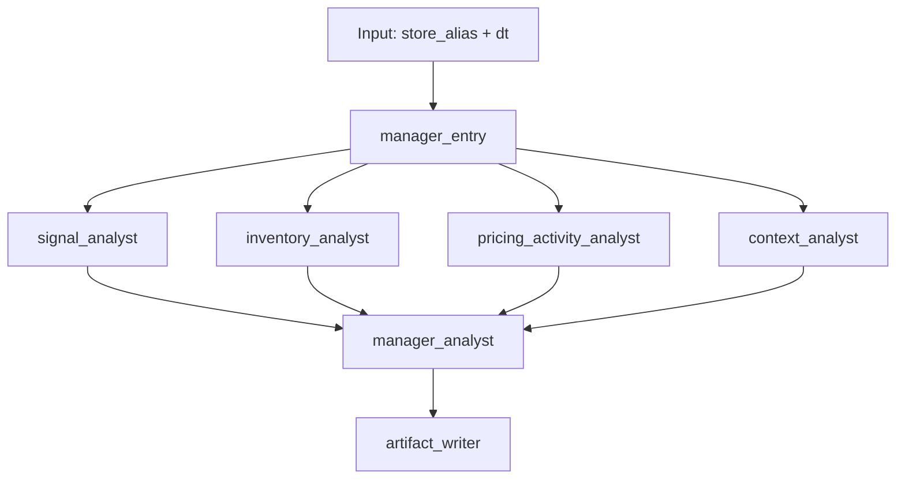

# Retail Insight Agent

Retail Insight Agent is a personal learning project for building an evidence-backed retail RCA workflow.

Current implemented milestones:

- Phase 1: scoped raw data ingested into DuckDB
- Milestone B: reliability checks plus a read-only evidence viewer
- Milestone C starting point: precomputed drop/lift signal exploration for daily store RCA
- Milestone D: parallel specialist analysts plus manager synthesis over local evidence

## Current Scope

- Source dataset: FreshRetailNet-50K `train.parquet`
- City scope: `city_id = 0`
- Store scope: 15 mapped store aliases
- Trusted artifact for tests and UI: `data/db/rca_foundry.duckdb`
- Read-only UI: store/date evidence viewer over exported DuckDB data
- Runnable backend path: parallel multi-agent RCA over DuckDB-backed evidence

## Project Layout

```text
retail-insight-agent/
│
├── AGENTS.md                    # Agent guardrails and out-of-scope boundaries
├── CLAUDE.md                    # AI session routing — points to README and AGENTS.md
├── README.md                    # Primary project doc (this file)
│
├── data/
│   ├── raw/
│   │   ├── train.parquet        # Source dataset (FreshRetailNet-50K, city_id=0); not committed
│   │   └── train_metadata.json  # Column descriptions for the raw parquet
│   ├── db/
│   │   ├── rca_foundry.duckdb   # Analytical DB — dimension and fact tables; committed as test artifact
│   │   └── run_logs.duckdb      # Pipeline run event log — persisted across runs; not committed
│   └── analysis/
│       ├── store_day_sales_signals.csv      # Per-store per-day signal metrics (pct changes, baselines)
│       ├── pct_trigger_by_store.csv         # Per-store trigger counts at each threshold
│       ├── pct_trigger_by_date.csv          # Per-date trigger counts at each threshold
│       ├── pct_trigger_overall_summary.csv  # Fleet-level summary (triggered store-days, drop/lift split)
│       ├── signal_distribution_summary.csv  # Distribution of signal magnitudes
│       ├── signal_threshold_grid.csv        # Grid of drop/lift counts across pct × abs threshold pairs
│       ├── store_signal_stability.csv       # How consistently each store triggers across thresholds
│       ├── trigger_grids/
│       │   └── trailing_7d_pct_trigger_grid_NN.csv  # Store × date grid (D/L/.) at threshold NN%
│       └── agent_benchmark_runs/
│           └── <timestamp>/                 # One folder per benchmark batch run
│               ├── README.md                #   Manifest with scenario links
│               ├── manifest.json            #   Machine-readable summary rows
│               └── <scenario_id>/
│                   ├── report.md            #   Manager RCA report (markdown)
│                   ├── report.html          #   Manager RCA report (rendered)
│                   ├── manager_trace.json   #   Full payload: specialist memos + manager output
│                   ├── trace.json           #   Benchmark payload including signal snapshot and metadata
│                   └── specialists/
│                       ├── <analyst>.md     #   Per-specialist memo (markdown)
│                       └── <analyst>.html   #   Per-specialist memo (rendered)
│
├── docs/
│   ├── PRD.md                   # Product requirements and milestone definitions
│   ├── UI_PLAN.md               # Evidence viewer design notes
│   ├── images/
│   │   └── agent_runtime_dag.svg  # Visual of the manager–specialist DAG
│   └── analysis/
│       ├── rca_test_scenarios.md     # Fixed benchmark scenario definitions
│       └── agent_benchmark_review.md # Qualitative review notes across benchmark runs
│
├── scripts/
│   ├── ingest_daily_tables.py   # Load train.parquet → rca_foundry.duckdb (dimension + fact tables)
│   ├── validate_daily_tables.py # Assert row counts and schema correctness against expected values
│   ├── analyze_sales_signals.py # Compute drop/lift signals, write to data/analysis/
│   ├── export_ui_data.py        # Export evidence JSON for the UI evidence viewer
│   ├── build_dashboard.py       # Generate ui/dashboard.html from analysis CSVs + run_logs.duckdb
│   ├── run_rca_agent.py         # Single-agent RCA for one store/date (quick debug path)
│   ├── run_rca_manager.py       # Full manager–specialist pipeline for one store/date
│   ├── run_rca_benchmarks.py    # Batch benchmark across fixed scenarios; saves artifacts to data/analysis/
│   └── show_runs.py             # Print recent pipeline runs from run_logs.duckdb (terminal table)
│
├── sql/
│   ├── migrations/
│   │   └── 001_create_daily_tables.sql  # Schema for all dimension and fact tables in rca_foundry.duckdb
│   └── queries/
│       └── preview_store_day.sql        # Ad-hoc query for inspecting a store/date slice
│
├── src/
│   └── rca_foundry/
│       ├── __init__.py          # Package marker
│       ├── config.py            # Paths, constants, env loading, LLM settings helpers
│       ├── db.py                # DuckDB connect/rebuild helpers
│       ├── ingestion.py         # Raw parquet → DuckDB ingestion logic
│       ├── validation.py        # Table-level row count and schema assertions
│       ├── signals.py           # Signal label computation (drop/lift/neutral) over sales data
│       ├── query.py             # Read-only DuckDB query helpers for evidence retrieval
│       ├── rca_tools.py         # LLM tool function definitions (get_signal_evidence etc.)
│       ├── llm.py               # OpenAI-compatible client builder and chat completion helpers
│       ├── agent.py             # Single-agent RCA loop (tool-calling agent, no manager)
│       ├── multi_agent.py       # Manager–specialist pipeline: parallel specialists + manager synthesis
│       ├── run_logging.py       # RunLogger — collects events during a run, writes to run_logs.duckdb
│       └── render.py            # Markdown → HTML rendering for report artifacts
│
├── tests/
│   ├── test_agent.py            # Unit tests for the single-agent loop
│   ├── test_benchmarks.py       # Tests for benchmark scenario helpers
│   ├── test_multi_agent.py      # Tests for the manager–specialist pipeline
│   ├── test_query.py            # Tests for query helpers
│   ├── test_rca_tools.py        # Tests for tool functions
│   ├── test_run_logging.py      # Tests for RunLogger event capture and serialisation
│   └── test_validation.py       # Tests for table validation logic
│
└── ui/
    ├── dashboard.html           # Generated signal dashboard — rebuild with build_dashboard.py
    ├── public/
    │   └── evidence_data.json   # Exported evidence data for the evidence viewer
    └── src/
        ├── main.js              # Evidence viewer JS
        └── style.css            # Evidence viewer styles
```

## Commands

```bash
# Setup
uv sync

# Data pipeline
uv run python scripts/ingest_daily_tables.py       # load parquet → DuckDB
uv run python scripts/validate_daily_tables.py     # assert row counts and schema
uv run python scripts/analyze_sales_signals.py     # compute drop/lift signals → data/analysis/

# Run the agent
uv run python scripts/run_rca_agent.py --store h555 --dt 2024-05-16    # single-agent
uv run python scripts/run_rca_manager.py --store h555 --dt 2024-05-16  # manager pipeline
uv run python scripts/run_rca_benchmarks.py                             # full benchmark batch

# View results
uv run python scripts/show_runs.py                 # print recent run history (terminal table)
uv run python scripts/build_dashboard.py           # rebuild ui/dashboard.html

# Tests
uv run pytest
```

## Environment

- Example environment file: `.env.example`
- Local `.env` is auto-loaded and gitignored
- Current live model target: DeepSeek via the OpenAI-compatible API

```bash
$env:DEEPSEEK_API_KEY="sk-..."
$env:LLM_MODEL="deepseek-v4-flash"
# optional
$env:LLM_BASE_URL="https://api.deepseek.com"
$env:DEEPSEEK_THINKING="false"
```

## Data And Signal Notes

- The committed DuckDB artifact is the clean analytical output and current test input.
- The raw parquet file is expected locally at `data/raw/train.parquet` and is not committed.
- Sales-signal exploration outputs are written to `data/analysis/` and `docs/analysis/`.
- Current working signal direction: precompute daily `drop`, `lift`, and `neutral` labels per store-day from `trailing_7d_pct_change`.
- Current preferred discussion thresholds: `drop <= -20%` and `lift >= +30%`.
- Trigger grids for threshold review live under `docs/analysis/trigger_grids/`.
- The fixed early RCA benchmark set lives in `docs/analysis/rca_test_scenarios.md`.
- Benchmark reviews live under `docs/analysis/agent_benchmark_review.md`.

## Runtime Design

Current code runs this with plain Python concurrency, but the runtime is intentionally shaped like a LangGraph-style DAG.




### Common Pattern

This is the common shape people usually use for this style of agent system:

1. one entry or manager node receives the task
2. independent specialist analysts run in parallel
3. each specialist has access only to domain-relevant tools
4. a manager or synthesizer combines specialist outputs
5. logs and artifacts are saved for replay and review

### Current Stages

| stage | node | type | purpose | parallel |
| --- | --- | --- | --- | --- |
| 1 | `manager_entry` | workflow | start run, create shared context, dispatch specialists | no |
| 2 | `signal_analyst` | agent | validate signal and baseline movement | yes |
| 2 | `inventory_analyst` | agent | inspect stockout and availability evidence | yes |
| 2 | `pricing_activity_analyst` | agent | inspect discount and promotional evidence | yes |
| 2 | `context_analyst` | agent | inspect calendar, weather, and peer context | yes |
| 3 | `manager_analyst` | agent | synthesize specialist memos into final RCA | no |
| 4 | `artifact_writer` | workflow | save report, traces, and logs | no |

### Tool Access Matrix

| agent | role | tools allowed |
| --- | --- | --- |
| `signal_analyst` | confirm whether the trigger is real and how large it is relative to baselines | `get_signal_evidence`, `get_sales_context` |
| `inventory_analyst` | assess whether stockouts or availability likely contributed | `get_stockout_context`, `get_sales_context` |
| `pricing_activity_analyst` | assess pricing and promotional contribution | `get_discount_context`, `get_activity_context`, `get_sales_context` |
| `context_analyst` | assess day context and whether the move is store-specific or broader | `get_calendar_weather_context`, `get_peer_store_context`, `get_sales_context` |
| `manager_analyst` | synthesize specialist outputs into one report | no direct tools in the current version |

### Why This Split

- each analyst sees only the tools it needs
- each analyst writes a bounded memo instead of a full RCA
- the manager is forced to work from explicit intermediate outputs
- logs make it possible to inspect what happened at each step

### Logs And Artifacts

Every pipeline run writes events to `data/db/run_logs.duckdb` (table `run_log_event`). The DB is created automatically on first run and persists across runs.

Each event row captures: `seq`, `timestamp_sgt`, `run_name`, `actor_type`, `actor_name`, `action`, `subject`, `source`, `details_json`.

Visible event types per run: `workflow.started`, `agent.started`, `llm.completion_requested`, `agent.tool_call_started`, `tool.completed`, `agent.completed`, `llm.completion_finished`, `workflow.completed`.

To see a summary table of recent runs in the terminal:

```bash
uv run python scripts/show_runs.py
```

Benchmark runs also save file artifacts under `data/analysis/agent_benchmark_runs/<timestamp>/`:

- `<scenario_id>/report.md` and `report.html` — manager RCA report
- `<scenario_id>/manager_trace.json` — full payload (specialist memos + manager output)
- `<scenario_id>/trace.json` — benchmark payload (signal snapshot, model, metadata)
- `<scenario_id>/specialists/<analyst>.md` and `.html` — per-specialist memos
- `README.md` and `manifest.json` — run manifest with links to each scenario

### Current Limitations

- the manager does not yet have a compact combined evidence tool
- specialist tool use can still be a little repetitive
- output formatting still partly depends on model behavior
- the current implementation uses plain Python concurrency, not the LangGraph library itself

## Other Notes

- The UI is an evidence viewer only. It does not generate RCA conclusions.
- CI runs validation, tests, UI data export, and UI build from the committed DuckDB.
- Important analytical decisions should be reflected in `README.md`, `AGENTS.md`, `docs/PRD.md`, and the detailed notes under `docs/analysis/`.
