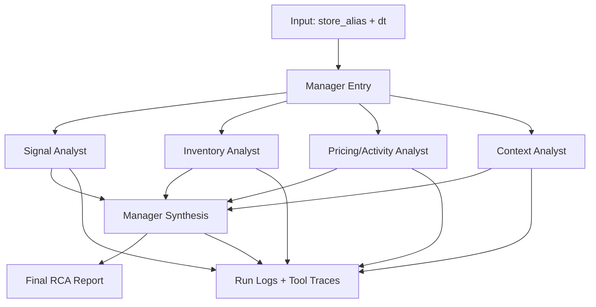

# Retail Insight Agent

Retail Insight Agent is a personal learning project for building an evidence-backed retail RCA workflow.

Current implemented milestones:

- Phase 1: scoped raw data ingested into DuckDB
- Milestone B: reliability checks plus a read-only evidence viewer
- Milestone C starting point: precomputed drop/lift signal exploration for daily store RCA
- Milestone D starting point: runnable tool-calling RCA agent over local evidence

## Current Scope

- Source dataset: FreshRetailNet-50K `train.parquet`
- City scope: `city_id = 0`
- Store scope: 15 mapped store aliases
- Trusted artifact for tests and UI: `data/db/rca_foundry.duckdb`
- Read-only UI: store/date evidence viewer over exported DuckDB data
- Runnable backend path: tool-calling RCA agent over DuckDB-backed evidence

## Project Layout

```text
retail-insight-agent/
  AGENTS.md
  README.md
  docs/
    AGENT_RUNTIME_DESIGN.md
    PRD.md
    UI_PLAN.md
  data/
    raw/
      train.parquet
      train_metadata.json
    db/
      rca_foundry.duckdb
  scripts/
    ingest_daily_tables.py
    run_rca_agent.py
    run_rca_manager.py
    run_rca_benchmarks.py
    export_ui_data.py
    validate_daily_tables.py
  sql/
    migrations/
      001_create_daily_tables.sql
    queries/
      preview_store_day.sql
  src/
    rca_foundry/
      __init__.py
      agent.py
      config.py
      db.py
      ingestion.py
      llm.py
      multi_agent.py
      query.py
      rca_tools.py
      run_logging.py
      validation.py
  tests/
    test_agent.py
    test_benchmarks.py
    test_multi_agent.py
    test_query.py
    test_rca_tools.py
    test_run_logging.py
    test_validation.py
  ui/
    public/
      evidence_data.json
    src/
      main.js
      style.css
```

## Commands

```bash
uv run python scripts/ingest_daily_tables.py
uv run python scripts/validate_daily_tables.py
uv run python scripts/analyze_sales_signals.py
uv run pytest
uv run python scripts/run_rca_agent.py --store h555 --dt 2024-05-16
uv run python scripts/run_rca_manager.py --store h555 --dt 2024-05-16
uv run python scripts/run_rca_benchmarks.py
uv run python scripts/export_ui_data.py
cd ui
npm install
npm run dev
```

## Notes

- The committed database artifact is the clean analytical output and the current test input.
- The raw parquet file is expected locally at `data/raw/train.parquet` and is not committed.
- Sales-signal exploration outputs are written to `data/analysis/` and `docs/analysis/`.
- Important analytical decisions should be reflected in `README.md`, `AGENTS.md`, `docs/PRD.md`, and the detailed note under `docs/analysis/`.
- Current working signal direction: precompute daily `drop`, `lift`, and `neutral` labels per store-day from `trailing_7d_pct_change`.
- Current preferred discussion thresholds: `drop <= -20%` and `lift >= +30%`.
- Trigger grids for threshold review live under `docs/analysis/trigger_grids/`.
- The fixed early RCA benchmark set lives in `docs/analysis/rca_test_scenarios.md`.
- Live benchmark batch outputs are saved under `data/analysis/agent_benchmark_runs/`.
- Benchmark scenario folders now include manager traces, specialist memos, and detailed event logs.
- The UI is an evidence viewer only. It does not generate RCA conclusions.
- CI runs validation, tests, UI data export, and UI build from the committed DuckDB.
- The agent backend uses domain-specific tool functions, not raw SQL exposure.
- The current multi-agent runtime uses parallel specialist analysts plus one manager synthesis step.
- First live model target: DeepSeek via the OpenAI-compatible API.
- Example environment file: `.env.example`
- Local `.env` is auto-loaded by the Python runtime config and is gitignored.
- Required environment for live agent runs:

```bash
$env:DEEPSEEK_API_KEY="sk-..."
$env:LLM_MODEL="deepseek-v4-flash"
# optional
$env:LLM_BASE_URL="https://api.deepseek.com"
$env:DEEPSEEK_THINKING="false"
```

## LangGraph Design

Current code runs this with plain Python concurrency, but the intended LangGraph-style shape is:



Runtime expectations:

- specialist analysts are independent and should run in parallel
- each analyst can call only its domain-relevant tools
- the manager reads specialist outputs and writes the final RCA report
- every LLM step and tool call should be logged with timestamps and actor identity

## Agent Design

Detailed design note:

- [docs/AGENT_RUNTIME_DESIGN.md](C:\Users\chiaw\OneDrive\Desktop\playground\retail_insight_agent\docs\AGENT_RUNTIME_DESIGN.md)

Current runtime stages:

| stage | node | purpose | parallel |
| --- | --- | --- | --- |
| 1 | `manager_entry` | start run, create shared context, dispatch specialists | no |
| 2 | `signal_analyst` | validate signal and baseline movement | yes |
| 2 | `inventory_analyst` | inspect stockout and availability evidence | yes |
| 2 | `pricing_activity_analyst` | inspect discount and promotional evidence | yes |
| 2 | `context_analyst` | inspect calendar, weather, and peer context | yes |
| 3 | `manager_analyst` | synthesize specialist memos into final RCA | no |
| 4 | `artifact_writer` | save report, traces, and logs | no |

Tool access by agent:

| agent | tools |
| --- | --- |
| `signal_analyst` | `get_signal_evidence`, `get_sales_context` |
| `inventory_analyst` | `get_stockout_context`, `get_sales_context` |
| `pricing_activity_analyst` | `get_discount_context`, `get_activity_context`, `get_sales_context` |
| `context_analyst` | `get_calendar_weather_context`, `get_peer_store_context`, `get_sales_context` |
| `manager_analyst` | no direct tools in the current version |
