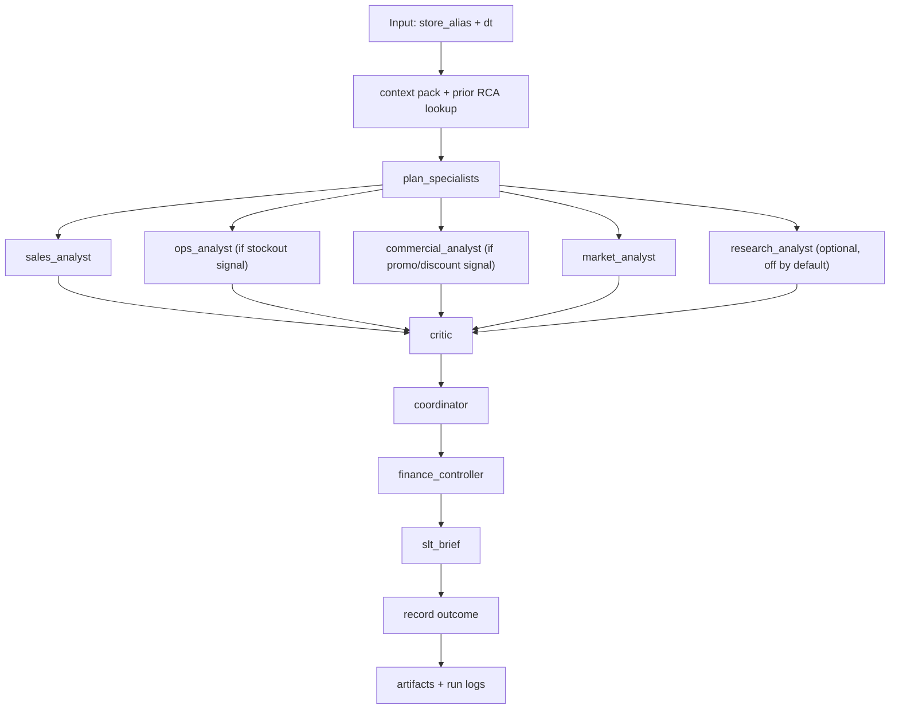

# Retail Insight Agent

Retail RCA playground built on a local DuckDB evidence store, with a calibration-first multi-agent workflow on top.

The current shape is:

1. Build clean daily store facts in DuckDB.
2. Precompute sales drop/lift signals.
3. Run a selective analyst workflow per store-day.
4. Produce a decision card, drill-down RCA, trace, and logs.
5. Store prior outcomes so later runs can tell first-time noise from recurring patterns.
6. Evaluate benchmark runs with deterministic faithfulness checks plus an LLM judge.
7. Generate a reader-friendly story report HTML for selected runs.

## Data Semantics

Important: the source dataset's `sale_amount` and `hours_sale` fields are **normalized sales amounts**, not literal unit counts and not currency revenue.

- The dataset card describes `sale_amount` as the daily sales amount after global normalization, multiplied by a specific coefficient.
- In this repo, aggregated store-day sales should therefore be read as **relative sales amounts for comparison and anomaly detection**.
- We should avoid wording like `units sold`, `revenue`, `$`, or margin math derived from these fields.
- Safe wording is:
  - `sales amount`
  - `normalized sales amount`
  - `relative sales level`

This matters because many RCA conclusions depend on comparing store-days correctly, not on pretending we know true commercial magnitude.

## Quick Start

```bash
uv sync
uv run python -m rca.cli build
uv run python -m rca.cli analyze
uv run python -m rca.cli profile
uv run python -m rca.cli run --store h555 --dt 2024-05-16 --full
uv run python -m rca.cli story --run-dir data/analysis/agent_benchmark_runs/<run_folder>
uv run python -m rca.cli runs
```

Dry-run mode exercises the whole workflow without API calls:

```bash
uv run python -m rca.cli run --store h555 --dt 2024-05-16 --dry-run --full
```

## Commands

| Command | What it does |
| --- | --- |
| `uv run python -m rca.cli build` | Ingest raw parquet into `data/rca.duckdb` and validate row counts |
| `uv run python -m rca.cli analyze` | Precompute signal CSVs and trigger grids under `data/analysis/` |
| `uv run python -m rca.cli profile` | Build `data/context_pack.json` and `data/context_pack.md` |
| `uv run python -m rca.cli run --store S --dt D [--dry-run] [--full]` | Run one RCA workflow; prints decision card by default |
| `uv run python -m rca.cli bench` | Run the 6 fixed benchmark scenarios |
| `uv run python -m rca.cli eval [--run-dir PATH] [--dry-run]` | Evaluate a benchmark run directory |
| `uv run python -m rca.cli story --run-dir PATH [--no-llm] [--dry-run]` | Generate root-level story report markdown and HTML for one run |
| `uv run python -m rca.cli runs` | Show recent run history from `data/runs.duckdb` |
| `uv run python -m rca.cli dashboard` | Rebuild the static dashboard HTML |
| `uv run python -m rca.cli export` | Refresh the UI evidence JSON |

## Runtime Design

The workflow is selective and calibration-first.




## Agent Roles

| Node | Role | Tool access |
| --- | --- | --- |
| `plan_specialists` | Cheap local planner that decides which analysts to run | local evidence functions only |
| `sales_analyst` | Confirms trigger magnitude and baseline comparisons | `get_signal_evidence`, `get_sales_context` |
| `ops_analyst` | Checks stockout and availability pressure | `get_stockout_context`, `get_sales_context` |
| `commercial_analyst` | Checks discount and activity effects; flags margin risk honestly | `get_discount_context`, `get_activity_context`, `get_sales_context` |
| `market_analyst` | Checks calendar, weather, and peer context | `get_calendar_weather_context`, `get_peer_store_context`, `get_sales_context` |
| `research_analyst` | Optional retrospective news search | `search_news` |
| `critic` | Downgrades weak claims and flags correlation-as-cause | no direct tools |
| `coordinator_analyst` | Synthesizes analyst memos into one RCA | no direct tools |
| `finance_controller` | Adds materiality, margin-risk, and one-off vs structural framing | no direct tools |
| `slt_brief` | Compresses the RCA into the decision card | no direct tools |
| `evaluator` | Offline judge for benchmark quality | no direct tools |

## LLM Configuration

The pipeline enforces `temperature = 0.0` for all API calls (including data extraction, tool usage, and report sanitization). 

**Motivation**: 
In earlier iterations, relying on default API temperatures (often `1.0` or `0.6` for models like DeepSeek) caused the agents to be overly "creative". For example, when tasked with querying peer stores, an analyst hallucinated a non-existent store alias (`m042`) and requested its data, which crashed the tool execution layer. 

By locking the temperature to `0.0`, we:
1. Ensure the agents remain strictly factual and grounded in the provided context.
2. Prevent tool parameter hallucinations.
3. Make the entire RCA workflow highly deterministic and reproducible across benchmark runs.

## Calibration Rules

- Outputs are correlational RCA, not proof of causality.
- Every specialist ends with an `Assessment` block.
- Confidence vocabulary is fixed: `high`, `medium`, `low`.
- The critic is part of the run and improves the current output.
- The evaluator is separate and scores the system offline.

## Data Layout

- `data/rca.duckdb`: daily store facts and dimensions
- `data/context_pack.json` / `.md`: compact grounding pack built from local data
- `data/analysis/`: signal summaries, trigger grids, benchmark outputs
- `data/runs.duckdb`: run log plus `rca_outcome` memory table
- `output/story_reports/`: root-level story report markdown and HTML generated from completed runs

## Run Artifacts

Each non-quick `rca run` writes a timestamped folder under `data/analysis/agent_benchmark_runs/` with:

- `decision_card.md` and `.html`
- `report.md` and `.html`
- `critique.md` and `.html`
- `controller_note.md` and `.html`
- `run_trace.json`
- `run_log.jsonl`
- `run_log.md`
- `specialists/*.md` and `.html`

Story reports are separate from the raw run folder. They are generated under:

```text
output/story_reports/<run_folder>/story_report.md
output/story_reports/<run_folder>/story_report.html
```

The story report is meant for reading and review. It summarizes how the RCA moved from trigger, to specialist evidence, to critic challenge, to final decision.

## Scenario Policy

The fixed six-scenario benchmark remains stable for regression work:

- 3 drops and 3 lifts
- across different store-prefix groups
- based on `trailing_7d_pct_change`

Ad hoc report examples can be selected separately when we want a more interesting narrative. For negative examples, prefer cases with:

- a true drop signal
- enough history for same-weekday comparison
- possible tension between stockout, promotion, calendar, and peer context
- a conclusion that is not just "big number moved"

Current exploratory negative candidate:

```text
l165 on 2024-06-06
```

Reason: it triggers a -30.4% trailing-7-day drop, but same-weekday baseline is nearly normal. That creates a useful RCA discussion about whether the alert is real, a window-composition artifact, or partially affected by stockout/promotion context.

## Evaluation

`rca eval` writes:

- `eval_report.json`
- `eval_report.md`

The evaluator combines:

- deterministic faithfulness checks against analyst tool outputs
- expected signal vs observed signal
- an LLM judge rubric for groundedness, calibration, actionability, conciseness, and causal honesty

## Notes

- Research is off by default because it adds external noise and cost.
- The context pack stays conservative about anonymized IDs.
- The decision card is the primary output; the full RCA is the drill-down.
