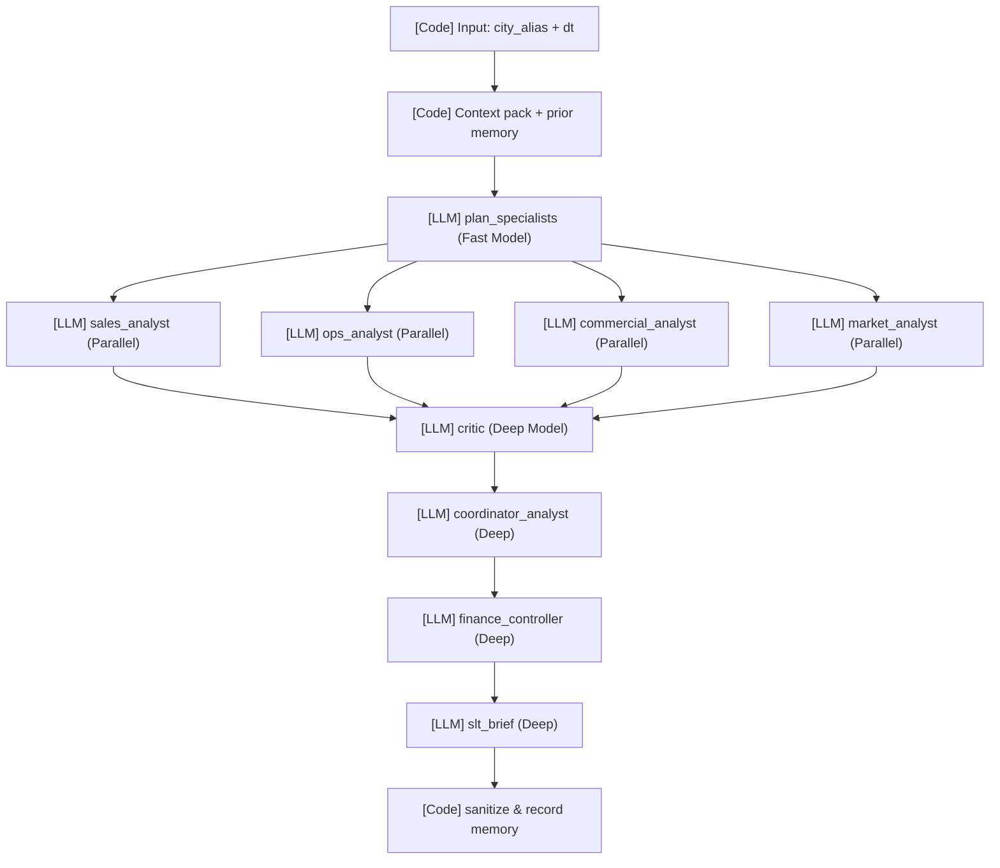

# Retail Insight Agent (Agents 101)

This project is a calibration-first, multi-agent Root Cause Analysis (Rca) system for retail city data. It is built on LangGraph and backed by a Supabase Postgres database.

## 1. What This Is

This repo demonstrates how to use LLM agents to perform rigorous, grounded RCA on anomalous city-wide sales signals (drops or lifts). The process is a "funnel" that starts with cheap, broad reasoning and ends with deep, synthesized oversight.



## 2. Components at a Glance

| Agent | Tools | Model | When | What it must change |
| --- | --- | --- | --- | --- |
| `plan_specialists` | local context checks | Fast | First node | Outputs an execution plan of which analysts to trigger. |
| `sales/ops/commercial/market` | `get_stockout_context`, `get_sales_context`, etc | Fast | Parallel | Investigates the specific domain and outputs an evidence memo. |
| `critic` | None | Deep | Post-analysis | Downgrades weak claims, flags false causality. |
| `coordinator` | None | Deep | Synthesis | Merges the separate memos into one cohesive RCA report. |
| `finance_controller` | None | Deep | Framing | Adds margin risk and structural impact framing. |
| `slt_brief` | None | Deep | Last node | Compresses everything into a short decision card. |

## 3. How an LLM Agent Works

In this system, agents use a **ReAct loop** (Reasoning + Acting). 
- **System Prompt**: Defines the persona (e.g., "You are an Ops Analyst...").
- **Tools**: Functions the agent can call (e.g., `get_stockout_baseline()`).
- **Loop**: The agent receives context, reasons about what it needs, calls a tool, observes the result, and iterates until it has enough evidence to form a conclusion.
- **Parallel Specialists**: Instead of one massive agent that hallucinates, we run bounded specialists in parallel (e.g. ops vs commercial) who are only allowed to see their own narrow domains.

## 4. Why Critic, Coordinator, and Decision Card?

The funnel logic is designed for **calibration**.
- Raw agent memos are often overly confident.
- The **Critic** exists solely to challenge the analysts ("You said promotions drove the lift, but the baseline data shows the lift started *before* the promo").
- The **Coordinator** resolves the tension.
- The **Decision Card** forces the output into a strictly formatted, confidence-led brief for the SLT (Senior Leadership Team). 

## 5. Staying Honest

- **Faithfulness**: Temperature is locked to `0.0`. Agents are not allowed to invent numbers.
- **Data Guardrails**: Sales figures are normalized coefficients. Agents are banned from using the `$` symbol or claiming literal "revenue".
- **Small-Sample Caution**: The local sandbox aggregates into 5 regional cities. Agents are prompted to acknowledge that inter-city peer-comparisons on such a small group are statistically weak.
- **LLM-as-judge ≠ Critic**: The critic runs *during* the workflow to improve the result. The `evaluator` judge runs offline afterward to score the benchmark performance.

## 6. Memory Over Time

- **Episodic Memory**: Every completed RCA is recorded in the `rca_outcome` table.
- **Semantic Profile**: We periodically run `rca distil` to compress the history into a standing `rca_city_profile`.
- **Retrieval**: Next time the city triggers an alert, the planner reads the profile to know if this is a recurring problem or a new one.
- **Tools**: Use `rca reset-memory` to wipe it.

## 7. Model Routing

- **Fast Model** (`DEEPSEEK_MODEL_FAST`): Used for cheap planning and parallel specialists.
- **Deep Model** (`DEEPSEEK_MODEL_DEEP`): Used for the critic, coordinator, and SLT nodes where high reasoning and oversight are required. This optimizes cost without losing rigor.

## 8. The Ecosystem

- **LangGraph**: The orchestration framework managing the DAG, state, and retries.
- **MCP (FastMCP)**: Exposes the RCA analytical read tools to external systems securely (`rca mcp`).
- **Skills**: Claude Markdown guidelines (`.claude/skills/`) that teach Claude how to run workflows automatically.
- **Langfuse**: Observability layer tracing every prompt, response, and token cost (`rca/obs.py`).
- **Supabase**: Postgres system of record containing our `rca_` prefixed tables and memory.
- **Vercel**: Hosts the Next.js App Router dashboard (`dashboard/`), featuring a premium glassmorphism UI built with pure Tailwind CSS v4, Recharts, and dynamic signal heatmaps.

## 9. Glossary

- **City-day**: The primary grain of analysis.
- **Decision Card**: A concise summary generated by the `slt_brief` node containing confidence, materiality, and the bottom line.
- **Context Pack**: The initial structured text containing baseline data injected into the state.
- **ReAct**: Reason + Act. The underlying pattern the LangChain models use to invoke tools.

## 10. CLI Commands

```bash
uv run python -m rca.cli build        # Ingest parquet into DuckDB
uv run python -m rca.cli analyze      # Precompute signals
uv run python -m rca.cli profile      # Build context pack
uv run python -m rca.cli run --store city_0 --dt 2024-05-16 --full
uv run python -m rca.cli bench        # Run fixed benchmark scenarios
uv run python -m rca.cli eval         # Evaluate benchmark quality
uv run python -m rca.cli story --run-dir <dir> # Generate story markdown
uv run python -m rca.cli runs         # Show run history
uv run python -m rca.cli distil       # Distil semantic memory
uv run python -m rca.cli reset-memory # Wipe city memory
uv run python -m rca.cli mcp          # Start FastMCP server
```

## 11. Data Structure

- **Raw**: FreshRetailNet-50K parquet (DuckDB local ETL).
- **Scope**: Local sandbox aggregates raw store data into 5 distinct cities.
- **Supabase Schema**: `public`.
- **Tables**: `rca_store_series`, `rca_store_normals`, `rca_outcome`, `rca_store_profile`. (Note: Though tables maintain the `store_` prefix for legacy schema compatibility, they represent city-level aggregates).
