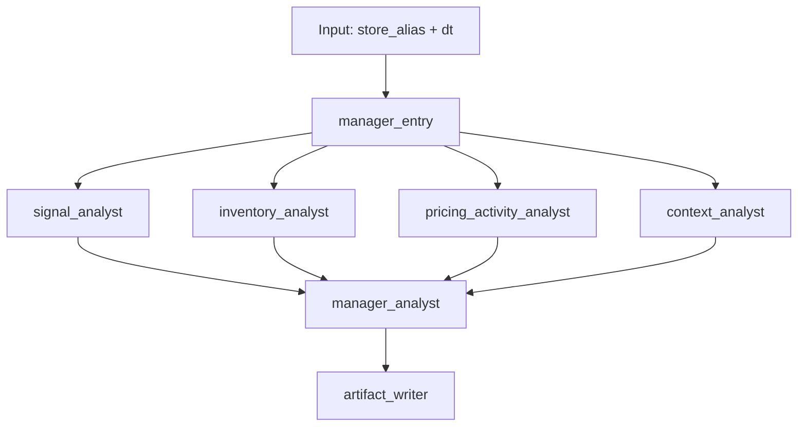

# Retail Insight Agent

Retail Insight Agent is a personal learning project for building an evidence-backed retail RCA workflow.

Current implemented milestones:

- Phase 1: scoped raw data ingested into DuckDB
- Milestone B: reliability checks plus a read-only evidence viewer
- Milestone C starting point: precomputed drop/lift signal exploration for daily store RCA
- Milestone D: parallel specialist analysts plus manager synthesis over local evidence

## Current Scope

- Source dataset: FreshRetailNet-50K `train.parquet`
- City scope: `city_id = 0`
- Store scope: 15 mapped store aliases
- Trusted artifact for tests and UI: `data/db/rca_foundry.duckdb`
- Read-only UI: store/date evidence viewer over exported DuckDB data
- Runnable backend path: parallel multi-agent RCA over DuckDB-backed evidence

## Project Layout

```text
retail-insight-agent/
  AGENTS.md
  README.md
  docs/
    PRD.md
    UI_PLAN.md
  data/
    raw/
      train.parquet
      train_metadata.json
    db/
      rca_foundry.duckdb
  scripts/
    ingest_daily_tables.py
    run_rca_agent.py
    run_rca_manager.py
    run_rca_benchmarks.py
    export_ui_data.py
    validate_daily_tables.py
  sql/
    migrations/
      001_create_daily_tables.sql
    queries/
      preview_store_day.sql
  src/
    rca_foundry/
      __init__.py
      agent.py
      config.py
      db.py
      ingestion.py
      llm.py
      multi_agent.py
      query.py
      rca_tools.py
      run_logging.py
      validation.py
  tests/
    test_agent.py
    test_benchmarks.py
    test_multi_agent.py
    test_query.py
    test_rca_tools.py
    test_run_logging.py
    test_validation.py
  ui/
    public/
      evidence_data.json
    src/
      main.js
      style.css
```

## Commands

```bash
uv sync
uv run python scripts/ingest_daily_tables.py
uv run python scripts/validate_daily_tables.py
uv run python scripts/analyze_sales_signals.py
uv run pytest
uv run python scripts/run_rca_agent.py --store h555 --dt 2024-05-16
uv run python scripts/run_rca_manager.py --store h555 --dt 2024-05-16
uv run python scripts/run_rca_benchmarks.py
```

## Environment

- Example environment file: `.env.example`
- Local `.env` is auto-loaded and gitignored
- Current live model target: DeepSeek via the OpenAI-compatible API

```bash
$env:DEEPSEEK_API_KEY="sk-..."
$env:LLM_MODEL="deepseek-v4-flash"
# optional
$env:LLM_BASE_URL="https://api.deepseek.com"
$env:DEEPSEEK_THINKING="false"
```

## Data And Signal Notes

- The committed DuckDB artifact is the clean analytical output and current test input.
- The raw parquet file is expected locally at `data/raw/train.parquet` and is not committed.
- Sales-signal exploration outputs are written to `data/analysis/` and `docs/analysis/`.
- Current working signal direction: precompute daily `drop`, `lift`, and `neutral` labels per store-day from `trailing_7d_pct_change`.
- Current preferred discussion thresholds: `drop <= -20%` and `lift >= +30%`.
- Trigger grids for threshold review live under `docs/analysis/trigger_grids/`.
- The fixed early RCA benchmark set lives in `docs/analysis/rca_test_scenarios.md`.
- Benchmark reviews live under `docs/analysis/agent_benchmark_review.md`.

## Runtime Design

Current code runs this with plain Python concurrency, but the runtime is intentionally shaped like a LangGraph-style DAG.




### Common Pattern

This is the common shape people usually use for this style of agent system:

1. one entry or manager node receives the task
2. independent specialist analysts run in parallel
3. each specialist has access only to domain-relevant tools
4. a manager or synthesizer combines specialist outputs
5. logs and artifacts are saved for replay and review

### Current Stages

| stage | node | type | purpose | parallel |
| --- | --- | --- | --- | --- |
| 1 | `manager_entry` | workflow | start run, create shared context, dispatch specialists | no |
| 2 | `signal_analyst` | agent | validate signal and baseline movement | yes |
| 2 | `inventory_analyst` | agent | inspect stockout and availability evidence | yes |
| 2 | `pricing_activity_analyst` | agent | inspect discount and promotional evidence | yes |
| 2 | `context_analyst` | agent | inspect calendar, weather, and peer context | yes |
| 3 | `manager_analyst` | agent | synthesize specialist memos into final RCA | no |
| 4 | `artifact_writer` | workflow | save report, traces, and logs | no |

### Tool Access Matrix

| agent | role | tools allowed |
| --- | --- | --- |
| `signal_analyst` | confirm whether the trigger is real and how large it is relative to baselines | `get_signal_evidence`, `get_sales_context` |
| `inventory_analyst` | assess whether stockouts or availability likely contributed | `get_stockout_context`, `get_sales_context` |
| `pricing_activity_analyst` | assess pricing and promotional contribution | `get_discount_context`, `get_activity_context`, `get_sales_context` |
| `context_analyst` | assess day context and whether the move is store-specific or broader | `get_calendar_weather_context`, `get_peer_store_context`, `get_sales_context` |
| `manager_analyst` | synthesize specialist outputs into one report | no direct tools in the current version |

### Why This Split

- each analyst sees only the tools it needs
- each analyst writes a bounded memo instead of a full RCA
- the manager is forced to work from explicit intermediate outputs
- logs make it possible to inspect what happened at each step

### Logs And Artifacts

Live benchmark batch outputs are saved under `data/analysis/agent_benchmark_runs/`.

Each scenario folder now includes:

- `report.md`
- `manager_trace.json`
- `specialists/*.md`
- `logs/event_log.jsonl`
- `logs/event_log.md`

Each log event captures:

- timestamp
- actor type
- actor name
- action
- subject
- source
- details

So you can see:

- workflow started
- specialist started
- LLM completion requested
- tool call started
- tool completed
- specialist completed
- manager completed

### Current Limitations

- the manager does not yet have a compact combined evidence tool
- specialist tool use can still be a little repetitive
- output formatting still partly depends on model behavior
- the current implementation uses plain Python concurrency, not the LangGraph library itself

## Other Notes

- The UI is an evidence viewer only. It does not generate RCA conclusions.
- CI runs validation, tests, UI data export, and UI build from the committed DuckDB.
- Important analytical decisions should be reflected in `README.md`, `AGENTS.md`, `docs/PRD.md`, and the detailed notes under `docs/analysis/`.
