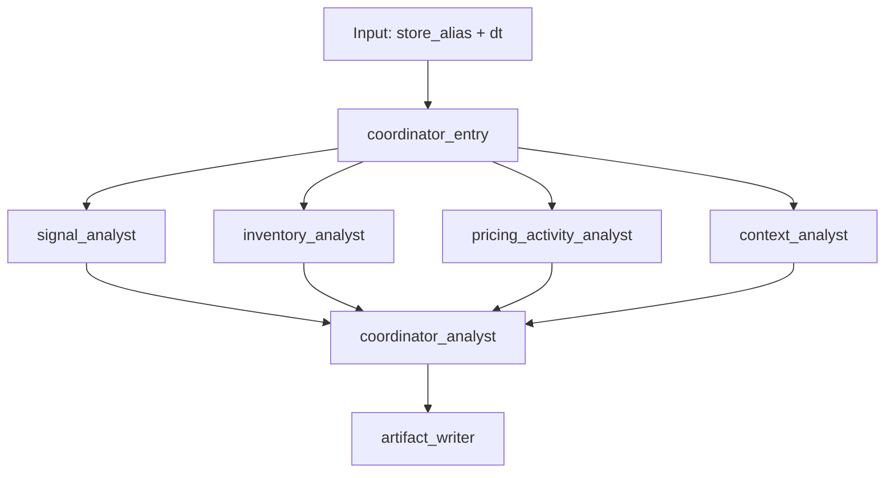
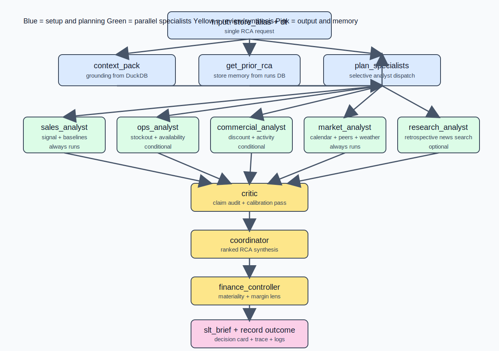

# Retail Insight Agent

A coordinator-led multi-agent system for retail root cause analysis (RCA), running over a DuckDB-backed evidence store built from raw store sales data.

## Quick Start

```bash
uv sync                                       # install dependencies
rca build                                     # ingest parquet → data/rca.duckdb, validate
rca analyze                                   # compute signals → data/analysis/*.csv
rca run --store h555 --dt 2024-05-16          # run coordinator pipeline for one store-day
open ui/public/dashboard.html                 # view signal grid + recent runs
rca runs                                      # print run history in terminal
```

> **DB migration note:** if you are upgrading from the old structure, copy `data/db/rca_foundry.duckdb` to `data/rca.duckdb` before running.

## Commands

| Command | Description |
| --- | --- |
| `rca build` | Ingest `data/raw/train.parquet` into `data/rca.duckdb` and validate row counts |
| `rca analyze` | Compute drop/lift signals → `data/analysis/*.csv` |
| `rca run --store S --dt D [--quick]` | Coordinator pipeline for one store-day; `--quick` runs signal specialist only |
| `rca bench` | Batch benchmark over 6 fixed scenarios |
| `rca dashboard` | Regenerate `ui/public/dashboard.html` from analysis CSVs and run logs |
| `rca export` | Refresh `ui/public/evidence_data.json` for the Vite evidence viewer |
| `rca runs` | Print recent run history from `data/runs.duckdb` |

## Agent Architecture

The pipeline is coordinator-led. `plan_specialists()` is the planning seam — it decides which specialist agents to dispatch for a given store-day. For now it always dispatches all four; the seam exists so future filtering by signal magnitude or direction is a small local change.





### Specialists

| Specialist | Focus | Tools |
| --- | --- | --- |
| `signal_analyst` | Validate signal direction and baseline comparison | `get_signal_evidence`, `get_sales_context` |
| `inventory_analyst` | Stockout and availability assessment | `get_stockout_context`, `get_sales_context` |
| `pricing_activity_analyst` | Discount and promotional contribution | `get_discount_context`, `get_activity_context`, `get_sales_context` |
| `context_analyst` | Calendar, weather, and peer comparison | `get_calendar_weather_context`, `get_peer_store_context`, `get_sales_context` |

The coordinator (`coordinator_analyst`) has no direct tool access — it synthesizes from specialist memos only.

Each specialist writes a bounded memo. The coordinator synthesizes them into a final RCA report with sections: Trigger, Likely Drivers, Evidence, Caveats, Suggested Next Checks.

## Data

`data/rca.duckdb` holds all analytical tables: `dim_store`, `dim_holiday_day`, `dim_weather_day`, and four fact tables (sales, stockout, discount, activity) at store-day granularity — 15 stores, 90 days, 1,350 store-day rows each.

`data/analysis/` holds precomputed signal CSVs (drop/lift labels, trigger grids, per-store stats). These are inputs to the dashboard and to `rca run`.

`data/runs.duckdb` holds the run event log — every pipeline run appends rows to the `run_log_event` table. Created automatically on first run, gitignored.

## Viewing Results

- Open `ui/public/dashboard.html` in a browser to see the signal grid (store × date, D/L/.) and a table of recent pipeline runs. Regenerate with `rca dashboard`.
- Run `rca runs` in the terminal for a summary table of recent runs.
- Each `rca run` with an output dir writes `report.html` and per-specialist HTML memos under `data/analysis/agent_benchmark_runs/`.

## Environment

Copy `.env.example` to `.env` and fill in your API key. The `.env` file is auto-loaded and gitignored.

```bash
DEEPSEEK_API_KEY=sk-...
LLM_MODEL=deepseek-v4-flash
# optional
LLM_BASE_URL=https://api.deepseek.com
DEEPSEEK_THINKING=false
```
