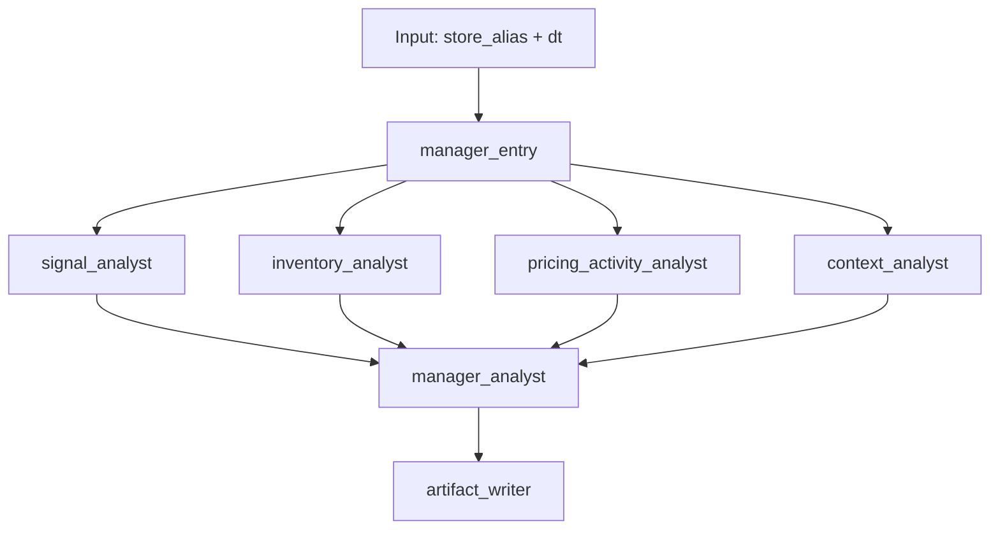

# Agent Runtime Design

This document describes the current multi-agent RCA runtime shape.

The goal is to keep agents narrow, evidence-bounded, and easy to inspect.

## Common Pattern

A common pattern for this kind of system is:

1. one entry or manager node receives the task
2. independent specialist analysts run in parallel
3. each specialist has access only to domain-relevant tools
4. a manager or synthesizer agent combines the specialist outputs
5. logs and artifacts are saved for replay and review

That is the pattern used here.

## Current Stages

| stage | node | type | purpose | runs in parallel |
| --- | --- | --- | --- | --- |
| 1 | manager_entry | workflow | accept `store_alias + dt`, start run logging, dispatch specialists | no |
| 2 | signal_analyst | agent | validate trigger and baseline movement | yes |
| 2 | inventory_analyst | agent | inspect stockout and availability pressure | yes |
| 2 | pricing_activity_analyst | agent | inspect discounting and promotional activity | yes |
| 2 | context_analyst | agent | inspect calendar, weather, and peer context | yes |
| 3 | manager_analyst | agent | synthesize specialist memos into final RCA report | no |
| 4 | artifact_writer | workflow | save final report, specialist memos, traces, and logs | no |

## Tool Access Matrix

| agent | role | tools allowed |
| --- | --- | --- |
| `signal_analyst` | confirm whether the trigger is real and how large it is relative to baselines | `get_signal_evidence`, `get_sales_context` |
| `inventory_analyst` | assess whether stockouts or availability likely contributed | `get_stockout_context`, `get_sales_context` |
| `pricing_activity_analyst` | assess pricing and promotional contribution | `get_discount_context`, `get_activity_context`, `get_sales_context` |
| `context_analyst` | assess day context and whether the move is store-specific or broader | `get_calendar_weather_context`, `get_peer_store_context`, `get_sales_context` |
| `manager_analyst` | synthesize specialist outputs into one report | no direct tools in the current version |

## DAG

## Why This Split

This split is meant to keep the model honest:

- each analyst sees only the tools it needs
- each analyst writes a bounded memo instead of a full RCA
- the manager is forced to work from explicit intermediate outputs
- logs make it possible to inspect what happened at each step

## Log Design

Each scenario run should save:

- final manager report
- specialist memo files
- manager trace JSON
- event log in JSONL
- event log in markdown

Each log event should show:

- timestamp
- actor type
- actor name
- action
- subject
- source
- details

Examples:

- workflow started
- specialist started
- LLM completion requested
- tool call started
- tool completed
- specialist completed
- manager completed

## Current Limitations

- the manager does not yet have a compact combined evidence tool
- specialist tool use can still be a little repetitive
- some output formatting still depends on model behavior
- the current implementation uses plain Python concurrency, not the LangGraph library itself

## Next Likely Improvement

The next likely backend improvement is:

1. add one compact RCA evidence tool for the manager or specialists
2. keep existing domain tools for deeper drill-down
3. rerun benchmark scenarios and compare:
   - tool counts
   - report quality
   - causal discipline
   - log readability
