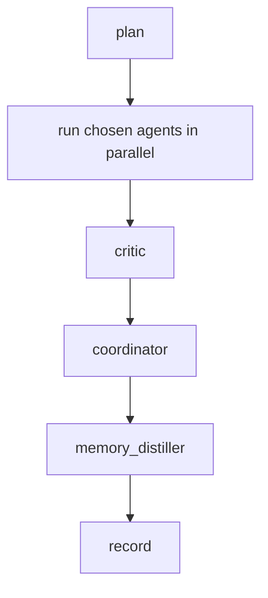

# Agent System Study Notes

This document is meant to be a learning guide for the agent system in this project.

It is written for a wide range of readers:

- beginner: you want to understand what an autonomous agent system is and how the pieces fit together
- intermediate: you can already build LLM apps and want to understand orchestration, tools, and memory more deeply
- advanced: you want to inspect design tradeoffs, runtime behavior, and implementation details

The goal is not only to explain what the system does, but why it is designed this way.

## Table of Contents

1. What this project is trying to teach
2. Big picture architecture
3. Why the system uses city/date grain
4. Why `build`, `signal`, and `run` are split
5. Runtime data model
6. Agent system overview
7. LangGraph orchestration design
8. Planning design
9. Specialist agent design
10. Tool design
11. Dynamic memory design
12. Outcome, logging, and trace persistence
13. Dashboard design
14. External research design
15. Technical tradeoffs and non-goals
16. Common debugging workflow
17. How to extend this system
18. Key lessons for agent engineering

## What this project is trying to teach

This project is not a production retail analytics platform.

It is a learning sandbox for building a small but real autonomous agent system. The main teaching goals are:

- how to turn rawer business data into a tool-using agent workflow
- how to split a system into ingestion, screening, reasoning, memory, and presentation layers
- how to let the LLM do meaningful work at runtime instead of hiding everything in ETL
- how to inspect what the agent did after the run
- how to keep the system simple enough that you can reason about it end to end

In other words: this is meant to feel closer to a small coding agent or analyst agent harness than to a static dashboard.

## Big picture architecture

At a high level, the project has four layers:

1. Data ingestion layer
2. Signal generation layer
3. LLM runtime layer
4. Dashboard and inspection layer

The flow is:

```text
parquet
  ->
rca build
  ->
base tables in Supabase
  ->
rca signal
  ->
signal table in Supabase
  ->
rca run --city --date
  ->
agent workflow + tools + memory
  ->
outcomes / logs / completions / memory
  ->
dashboard
```

This split is important.

Many early agent projects mix all of these concerns together. That usually creates confusion:

- you do not know which layer is wrong
- you cannot tune the signal logic without reingesting everything
- you cannot tell whether a bug is from data prep or LLM reasoning

This repo separates those layers on purpose.

## Why the system uses city/date grain

The runtime grain is city/date only.

That means every tool the agent uses is based on evidence like:

- city 0 on 2024-06-09
- total sales for that day
- expected sales for that day
- hourly sales shape for that day
- stockout rates for that day

We intentionally do not expose store-level or product-level runtime tools.

### Why this constraint exists

Because it teaches better.

If you keep full store/product detail in the live agent loop, several things happen:

- the prompt context explodes
- tools become too granular
- the dashboard turns into a drilldown app
- the agent spends effort navigating detail instead of reasoning over business signals

By forcing city/date grain:

- the database stays compact
- the tools stay interpretable
- the dashboard stays simple
- the agent still has real work to do

### What happens to raw store/product data

It is not ignored.

It is aggregated into city/date evidence such as:

- `store_count`
- `product_count`
- `active_product_count`
- `stockout_product_count`
- hourly sales totals
- hourly stockout rates

So store/product data still influences the runtime, just not as first-class runtime entities.

## Why `build`, `signal`, and `run` are split

This is one of the most important design decisions in the repo.

### `rca build`

Purpose:

- stable ingestion
- deterministic transformation
- parquet -> Supabase base tables

What it should feel like:

- reliable
- boring
- easy to rerun
- low conceptual risk

Tables produced:

- `rca.sales`
- `rca.inventory`
- `rca.pricing`
- `rca.promotions`
- `rca.calendar`
- `rca.weather`
- `rca.goals`

### `rca signal`

Purpose:

- create the screening layer that tells us which city/date is interesting enough to inspect

What it should feel like:

- tunable
- debatable
- changeable without rebuilding the whole warehouse

Table produced:

- `rca.signals`

This is where we create labels like:

- `drop`
- `lift`
- `neutral`
- `insufficient_history`

This layer is intentionally separate because signal logic is usually much more experimental than ingestion logic.

### `rca run`

Purpose:

- use the signal and base evidence to run the LLM workflow for one city/date

Outputs:

- `rca.outcomes`
- `rca.events`
- `rca.completions`
- `rca.memory`
- sometimes `rca.evidence_cache`
- sometimes `rca.external_events`

This separation gives us a cleaner mental model:

- build prepares facts
- signal chooses where to look
- run explains what happened

## Runtime data model

The runtime system of record is Supabase under schema `rca`.

### Base evidence tables

- `sales`
  - city/date sales totals
  - store/product counts
  - hourly sales columns

- `inventory`
  - stockout-related counts and rates
  - hourly stockout rates

- `pricing`
  - discount depth and discount participation

- `promotions`
  - activity signal features
  - activity sales and activity share

- `calendar`
  - weekday
  - weekend flag
  - inferred holiday name

- `weather`
  - aggregate weather context

- `goals`
  - synthetic expected sales
  - baseline method metadata

### Screening table

- `signals`
  - current sales
  - expected sales
  - deviation percentage
  - signal label

### LLM runtime tables

- `outcomes`
  - final synthesized result

- `events`
  - workflow and tool event log

- `completions`
  - raw node-level LLM outputs
  - includes `tool_calls_json`

- `memory`
  - distilled lessons

- `evidence_cache`
  - cached tool outputs keyed by build version and arguments

- `external_events`
  - cached web search results

## Agent system overview

The system is built around a small set of agents, each with a narrow role.

### Planner

Decides which agents to run for a city/date.

Its job is not to explain the business result.
Its job is to choose the investigation shape.

### Statistician

Acts like a lightweight data scientist.

It checks:

- recent baselines
- same-weekday baselines
- intraday shifts
- descriptive comparisons

This agent exists because we want the system to demonstrate runtime analysis instead of shoving all analysis into ETL.

### Sales agent

Focuses on the sales movement itself.

### Inventory agent

Focuses on stockout and availability pressure.

### Pricing agent

Focuses on discount behavior and price pressure.

### Promotions agent

Focuses on `activity_flag`, but with caution because the flag is unlabeled.

### Calendar/weather agent

Focuses on weekday, inferred holiday, and weather context.

### News agent

Focuses on external factors if research is enabled.

### Critic

Reviews the specialist output and downgrades weak claims.

This is important.

Without a critic, many agent systems become overconfident and sloppy.

### Coordinator

Synthesizes the evidence into the final business-facing answer.

### Memory distiller

Extracts reusable lessons from a completed run.

## LangGraph orchestration design

The graph is implemented in `rca/graph.py`.

The state contains:

- `city_id`
- `dt`
- `run_id`
- `signal_evidence`
- `planner_decision`
- `agent_results`
- `critic_note`
- `final_report`
- `memory_note`

### Why LangGraph is used

LangGraph is a good fit because it supports:

- explicit node-based orchestration
- state passed between nodes
- dynamic fanout
- bounded loops
- inspectable execution structure

This matters for learning because it makes the workflow visible.

### Actual flow



### Why this graph is good for learning

It is simple enough to inspect, but still teaches real design ideas:

- planning before action
- specialized workers
- critique before synthesis
- memory after outcome
- persistence at the end

## Planning design

Planning is often underestimated.

Many beginners think planning means “ask the model what to do.”
That is only part of it.

A useful planning layer should:

- know the allowed specialists
- know which ones are mandatory
- know when external research is disabled
- understand what evidence already exists
- produce structured output

In this project, the planner:

- always includes `statistician`
- always includes `sales_agent`
- can add or omit others based on context
- avoids `news_agent` when `RCA_RESEARCH_ENABLED=false`

This is a good example of “LLM freedom inside guardrails.”

## Specialist agent design

Each specialist has:

- a narrow focus
- a bounded tool set
- a skill file in `rca/agent_skills/`
- a structured markdown output format

This is important because open-ended agents tend to drift.

A specialist should not be “smart about everything.”
It should be “useful for one part of the investigation.”

### Why bounded tool sets matter

If every agent gets every tool:

- prompts become noisier
- tool choice becomes less meaningful
- debugging becomes harder
- agents start duplicating each other

By narrowing tool access, you create cleaner role boundaries.

## Tool design

Tools are implemented in `rca/tools.py`.

The key idea is that tools are not random helpers. They are the runtime evidence API.

Examples:

- `get_signal_evidence`
- `get_sales_context`
- `get_inventory_context`
- `get_pricing_context`
- `get_promotions_context`
- `get_calendar_weather_context`
- `get_intraday_profile`
- `compare_recent_baseline`
- `compare_same_weekday_baseline`
- `detect_intraday_shift`
- `get_memory_context`
- `search_external_events`

### Why this tool set is good for learning

It covers several important patterns:

- direct evidence retrieval
- derived comparison logic
- cached repeated computation
- internal vs external evidence
- semantic memory retrieval

### Important implementation lesson

Tools should return structured data that a model can reason over.

They should not dump giant raw tables or huge text blobs if a structured JSON result is possible.

## Dynamic memory design

This project uses a small custom memory system instead of a heavyweight memory framework.

That choice is deliberate.

### Memory types in this repo

1. Semantic-ish distilled memory
   - stored in `rca.memory`
   - short reusable lessons

2. Evidence cache
   - stored in `rca.evidence_cache`
   - avoids recomputing tool outputs

3. External event cache
   - stored in `rca.external_events`
   - avoids repeated web search

### Why this is called dynamic memory

Because the next run can reuse prior artifacts:

- prior lessons
- prior cached evidence
- prior external search results

This is not “memory” in the human sense.
It is reusable runtime state.

### Why we did not use a full memory framework

Because for v2:

- the scope is small
- the structure is clear
- Supabase tables are enough
- the custom implementation is easier to learn from

Frameworks are useful, but they can also hide how memory really works.

## Outcome, logging, and trace persistence

Persistence is one of the most educational parts of the system.

### `rca.outcomes`

Stores the final answer for a city/date.

This is what the RCA page mainly renders.

### `rca.events`

Stores workflow and tool events such as:

- planner started
- tool call completed
- coordinator completed

This is the coarse-grained execution trace.

### `rca.completions`

Stores node-level LLM outputs.

This includes:

- node name
- model
- token counts
- raw content
- `tool_calls_json`

This is the fine-grained LLM trace.

### `rca.memory`

Stores distilled lessons after a run.

### Why this matters

If you cannot inspect what the agent did, you cannot really learn from it.

Many demos only show the final answer.
That is not enough.

This project tries to preserve:

- what was decided
- what tools were used
- what the model wrote
- what reusable lesson was extracted

## Dashboard design

The dashboard is intentionally simple.

It is not meant to be an enterprise BI suite.

It is meant to help you inspect the system.

### Home page

The home page is a city signal heatmap.

Its job is to answer:

- which city/date is interesting
- which signal is drop or lift
- where should I click next

### City page

The city page is a lightweight investigation surface.

Its job is to answer:

- what is the actual vs synthetic goal trend
- which dates were triggered
- where should I jump into RCA

### RCA page

Shows the final business-facing explanation.

### Logs page

Shows:

- workflow events
- recent completions
- tool call traces

This is extremely important for learning agent behavior.

### Memory page

Shows distilled lessons.

This helps you see whether the system is actually learning reusable patterns.

## External research design

External research is optional.

That is a feature, not a weakness.

### Why it is optional

Because:

- local debugging should still work without web search
- not every RCA needs external evidence
- external evidence is noisier than internal evidence

### Current rule

If `RCA_RESEARCH_ENABLED=false`, the planner should not dispatch the news agent.

This is an example of operational policy controlling agent behavior.

## Technical tradeoffs and non-goals

This design is intentionally not trying to do everything.

### What we optimize for

- clarity
- inspectability
- reasonable realism
- modularity
- learning value

### What we do not optimize for yet

- perfect causal inference
- large-scale production observability
- multi-tenant SaaS architecture
- product/store drilldown analysis
- automated scheduling

### Why that is okay

Because educational systems benefit from strong boundaries.

You learn faster when the system is small enough to hold in your head.

## Common debugging workflow

When something looks wrong, debug by layer.

### 1. Check base ingestion

Run:

```bash
uv run python -m rca.cli build
```

Then check row counts in:

- `sales`
- `inventory`
- `pricing`
- `promotions`
- `calendar`
- `weather`
- `goals`

### 2. Check signal generation

Run:

```bash
uv run python -m rca.cli signal
```

Then inspect `rca.signals`.

Questions:

- are row counts correct
- are drop/lift counts plausible
- is the city/date you care about present

### 3. Check run execution

Run:

```bash
uv run python -m rca.cli run --city 0 --date 2024-06-09
```

Then inspect:

- `rca.outcomes`
- `rca.events`
- `rca.completions`
- `rca.memory`

### 4. Check dashboard wiring

If the backend tables are correct but the dashboard looks wrong:

- verify the dashboard is deployed from the correct branch
- verify the page is querying the correct table and correct typed `city_id`
- verify stale deployments are not showing old UI

### 5. Check permissions

If writes silently disappear:

- check schema exposure
- check RLS
- check table grants
- check sequence grants for `bigserial` tables

## How to extend this system

Here are good extension ideas.

### Better signal logic

You can improve `rca signal` without changing ingestion.

Examples:

- better holiday-aware baselines
- more robust outlier handling
- confidence scores for signals

### Better memory

You can extend `rca.memory` into richer memory types:

- lessons by theme
- city profiles
- durable hypotheses
- confidence-weighted memory

### Better external research

You can:

- add another search provider
- store better metadata
- add source ranking
- distinguish rumor vs verified source

### Better dashboard inspection

You can add:

- per-run trace pages
- node timeline views
- tool usage summaries
- memory diff views

## Key lessons for agent engineering

If you only remember a few things from this project, remember these:

### 1. Separate stable layers from experimental layers

Ingestion is more stable than signals.
Signals are more stable than LLM reasoning.

Do not collapse them together.

### 2. Let the LLM do real work, but not all the work

The model should reason, compare, and synthesize.
It should not replace data modeling, permissions, or storage design.

### 3. Bounded agents are easier to trust

Small role boundaries beat one giant vague analyst.

### 4. Memory is often just reusable state with policy

You do not need a magical memory system to get learning behavior.

### 5. Observability is part of the product

If you want to learn from an agent, logs and completions are not optional.

### 6. A simple dashboard can teach more than a fancy dashboard

A smaller surface often makes the agent behavior easier to understand.

### 7. Deployment discipline matters

If you debug on a deployed environment like Vercel, your finished work must be merged back to the deployed branch. Otherwise backend correctness and frontend correctness drift apart and you end up debugging the wrong thing.
