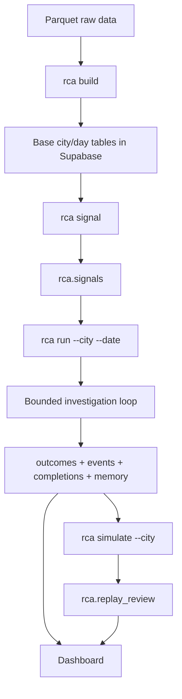
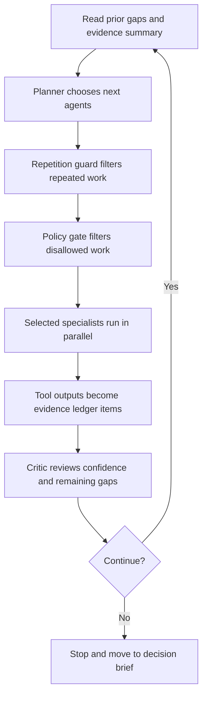

# Agent System Study Notes

This document is a long-form study guide for the agent system in this project.

It is meant to work for three audiences at once:

- **Beginner**: you are new to agent systems and want a practical mental model.
- **Intermediate**: you already build LLM workflows and want to understand planning, tools, memory, and evaluation more deeply.
- **Advanced**: you want to inspect design tradeoffs, runtime behavior, schema choices, and the boundary between a workflow and a real agentic harness.

This is not just a feature list.

The goal is to teach:

- what the system does
- why it is shaped this way
- how the pieces interact
- how to reason about future improvements without turning the project into theater

## Table of Contents

1. Why this project exists
2. The shortest possible mental model
3. What kind of AI system this is
4. The learning goals
5. The business framing
6. Why the runtime grain is city/date only
7. The architecture layers
8. Public CLI and why each command exists
9. The runtime data model in Supabase
10. How signals work
11. The graph and investigation loop
12. The agents and their jobs
13. The tools and why they are structured
14. Dynamic memory in this project
15. Evaluation, simulation, and self-review
16. The dashboard as an inspection surface
17. End-to-end walkthrough of one `rca run`
18. End-to-end walkthrough of one `rca simulate`
19. Why this is more than a static workflow
20. What makes the output useful for management
21. Common failure modes
22. Testing strategy for an agent system
23. Debugging checklist
24. How to extend the system safely
25. Design heuristics worth keeping

## Why this project exists

This project exists because many "AI analytics" demos cheat in one of two ways:

1. They precompute almost everything, then use the LLM only as a narrator.
2. They give the LLM too much freedom, then call the chaos "agentic."

We want something in between:

- deterministic where it should be deterministic
- adaptive where runtime reasoning adds value
- inspectable enough that a human can actually learn from it

That is why this repo is a **learning harness** first.

The output matters, but the more important lesson is how to build a system that can:

- plan
- gather evidence
- revise itself
- stay calibrated
- preserve reusable lessons
- show its work

## The shortest possible mental model

If you only want one paragraph, use this:

> Raw retail data is ingested into city/day tables, a signal layer decides which city/date looks interesting, a bounded multi-agent investigation loop runs RCA for one case, memory and traces are written back to Supabase, and a city simulation harness reruns many dates to study whether the system is improving over time.

If you want the one-line version:

> `build` prepares facts, `signal` chooses where to look, `run` explains one case, `simulate` evaluates learning behavior across many cases.

## What kind of AI system this is

People use words like "workflow," "agent," and "agentic" pretty loosely, so it helps to be precise.

### Pure workflow

A pure workflow is mostly fixed code:

```text
step 1 -> step 2 -> step 3 -> done
```

Good:

- cheap
- predictable
- easy to test

Weak:

- rigid
- not good at open-ended investigation

### Pure free-form agent

A pure free-form agent gives the model broad control:

- decide what to do
- decide what tool to use
- decide when to stop
- decide how to interpret everything

Good:

- flexible
- can feel surprisingly smart

Weak:

- hard to trust
- hard to debug
- easy to waste tokens
- easy to confuse "activity" with "progress"

### What this project is

This project is a **hybrid agentic system**.

That means:

- the **outer scaffold** is deterministic
- the **inner investigation behavior** is adaptive

More concretely:

| Part | Owner |
| --- | --- |
| Data ingestion | Deterministic code |
| Signal generation | Deterministic code |
| Persistence | Deterministic code |
| Policies and guardrails | Deterministic code plus prompts |
| Planning | LLM |
| Specialist choice | LLM within allowed roles |
| Tool use | LLM within bounded schemas |
| Critique and stopping | LLM within bounded loop |
| Final business synthesis | LLM |
| Simulation scoring | Deterministic evaluator plus reviewer LLM |

This is why the project feels more agentic than a fixed workflow, but much more disciplined than a totally open agent.

## The learning goals

The project is trying to teach several things at once.

### 1. Runtime reasoning should matter

We do not want to precompute every explanation in ETL.

We want the LLM to do real work at runtime:

- compare a day to recent history
- inspect intraday shape
- combine inventory, pricing, promotions, and calendar context
- decide when internal evidence is enough
- escalate to external research only when justified

### 2. The system should stay inspectable

A final answer alone is not enough.

We want to inspect:

- events
- node completions
- tool calls
- evidence ledger
- memory writes
- simulation review scores

### 3. The system should preserve lessons

Even in a small project, we want the idea of memory to be real:

- some knowledge from previous runs should survive
- some repeated work should be cached
- later runs in a simulation batch should not behave like total amnesia

### 4. The system should support learning by the builder

The repo is also for **your** learning, not only the model's learning.

That means the design should be clear enough that a human can study:

- where the logic lives
- what the prompts are doing
- which table stores which artifact
- what should be improved next

## The business framing

Even though this is a learning project, the system still needs a believable business frame.

The question is roughly:

> "A city experienced a meaningful drop or lift versus business expectation on a given date. What likely drove it, what should management do, and what should they watch next?"

That framing matters because it keeps the output tied to an audience.

### Internal vs external factors

This project explicitly separates:

- **Internal factors**: things we can read from Supabase
- **External factors**: things we need web search or news search to discover

Internal factors include:

- sales movement
- inventory pressure
- discount behavior
- promotion or activity patterns
- calendar context
- weather context

External factors include:

- city events
- unusual news
- disruptions
- public holiday context not obvious from local tables

This split is useful because it teaches a strong agent pattern:

- exhaust internal evidence first
- pull external evidence only when there is a justified gap

## Why the runtime grain is city/date only

This is one of the biggest design constraints in the repo.

The runtime unit is:

- one city
- one date

Not:

- product
- category
- store
- customer

### Why this is a good constraint

Without this constraint, an agentic RCA system gets messy quickly:

- prompts become too large
- tools become too granular
- conclusions become noisy
- the dashboard becomes a drilldown app instead of an inspection app

By forcing city/date grain, the system stays:

- compact
- teachable
- debuggable
- aligned with the PRD and your stated scope

### Important nuance

We are **not** throwing store/product data away.

We are doing this instead:

- aggregate stores up to city/day
- aggregate products up to city/day
- preserve useful summary fields like counts, rates, and hourly profiles

That means raw rows still matter, but they do not survive as first-class runtime entities.

This is exactly the kind of simplification that makes an agent system more useful, not less.

## The architecture layers

The repo has five conceptual layers.



### Layer 1: Ingestion

`rca build` is deterministic data preparation.

It should feel:

- stable
- boring
- reliable

### Layer 2: Signal generation

`rca signal` is the attention layer.

It should feel:

- tunable
- changeable
- easy to iterate on

### Layer 3: Runtime RCA

`rca run` is where the LLM earns its keep.

It should feel:

- adaptive
- evidence-driven
- bounded

### Layer 4: Simulation and review

`rca simulate` is the learning and quality-comparison layer.

It should feel:

- chronological
- measurable
- introspective

### Layer 5: Dashboard

The dashboard is not the product centerpiece.

It is the **inspection surface**.

It should help you answer:

- where is the signal
- what did the system conclude
- what did it do internally
- is simulation quality improving

## Public CLI and why each command exists

The public CLI is intentionally small:

```bash
uv run python -m rca.cli build
uv run python -m rca.cli signal
uv run python -m rca.cli run --city 0 --date 2024-06-09
uv run python -m rca.cli simulate --city 0
uv run python -m rca.cli mcp
```

### `rca build`

Purpose:

- parquet -> base `rca.*` tables

Why it exists separately:

- ingestion should be stable
- rebuilding base facts should not depend on signal tuning
- LLM reasoning should not be mixed into ETL

### `rca signal`

Purpose:

- rebuild the screening layer

Why it exists separately:

- signals are more experimental than ingestion
- you may want to refine thresholds or priority logic without touching base tables

### `rca run --city --date`

Purpose:

- run the agent workflow for exactly one city/date case

Why it exists separately:

- single-case debugging is essential
- it is the cleanest way to inspect one investigation

### `rca simulate --city`

Purpose:

- rerun every triggered date for one city, oldest to latest
- always start from a cold reset for that city

Why it exists separately:

- it is the closest thing to a learning harness in the repo
- it lets memory accumulate
- it produces quality comparisons across a batch

### `rca mcp`

Purpose:

- expose evidence tools through MCP

Why it exists:

- good learning surface
- useful for experimenting with external LLM interfaces
- teaches how a tool server differs from an app runtime

## The runtime data model in Supabase

Supabase is the runtime system of record.

That matters a lot.

It means:

- no local DuckDB runtime
- no hidden side database
- one place to inspect both data and agent artifacts

### Base tables

| Table | What it stores |
| --- | --- |
| `rca.sales` | city/day sales totals, counts, hourly sales |
| `rca.inventory` | stockout counts and rates |
| `rca.pricing` | discount depth and participation |
| `rca.promotions` | activity-related summaries |
| `rca.calendar` | weekday, weekend, holiday-style context |
| `rca.weather` | weather summaries |
| `rca.goals` | synthetic expected sales baselines |

### Signal table

| Table | What it stores |
| --- | --- |
| `rca.signals` | actual vs expected, deviation, label, priority, hints |

### Runtime artifact tables

| Table | What it stores |
| --- | --- |
| `rca.outcomes` | final RCA result for a run |
| `rca.events` | workflow and tool event log |
| `rca.completions` | raw node-level LLM outputs |
| `rca.memory` | distilled lessons |
| `rca.evidence_cache` | cached derived tool outputs |
| `rca.external_events` | cached external search results |
| `rca.replay_review` | replay review rows across batches |

### Why JSON columns matter here

For early-stage agent systems, JSON is often the right tradeoff.

Why:

- the artifact shape is still evolving
- migrations are expensive when the design is not settled
- we still want structured fields, not giant text blobs

This repo uses that idea in `rca.outcomes`:

- stable query fields are normal columns
- evolving reasoning artifacts are JSON

That is a good pattern for a learning-stage system.

## How signals work

Signals are not the RCA itself.

Signals are the **entry point** into RCA.

The signal layer answers:

- which city/date deserves attention
- what kind of move happened
- how urgent it might be

### Signal labels

At a high level, the label can be:

- `drop`
- `lift`
- `neutral`
- `insufficient_history`

### What signal generation is doing conceptually

It compares:

- actual city/day sales
- expected city/day sales from the goal table

Then it derives:

- deviation percentage
- severity or strength
- priority
- short hints that help the planner start

### Why signal logic should stay simple

You explicitly said you do not want heavy precomputed statistics in the signal layer.

That is the right instinct.

Signals should do enough to:

- screen
- rank
- label

Signals should **not** absorb the actual reasoning job.

That work belongs later in the runtime loop.

## The graph and investigation loop

The LangGraph outer shape is simple:

```text
START
  -> investigation_loop
  -> decision
  -> evaluation
  -> memory
  -> record
  -> END
```

That simplicity is intentional.

The more agentic behavior is inside `investigation_loop`.

### Why this is a good design

If every tiny action became a graph node:

- the graph would look impressive
- but the mental model would get worse

The current design keeps:

- the outer graph easy to explain
- the inner loop flexible enough to behave like an investigation

### Investigation loop logic

Each round does roughly this:



### Important control ideas

#### Bounded rounds

The loop is capped by `RCA_MAX_INVESTIGATION_ROUNDS`.

This prevents:

- endless wandering
- repeated tool spam
- invisible cost creep

#### Repetition guard

The system tries not to dispatch the same agent for the same gap over and over.

This is a small feature with outsized importance.

Without it, "agentic" systems often look busy but add little new evidence.

#### News gating

The `news_agent` is not supposed to fire just because it exists.

It is gated by:

- research enabled
- internal evidence already gathered
- critic identifying a true external-context gap

That is disciplined behavior.

## The agents and their jobs

The system uses narrow specialists.

That is a deliberate choice.

### Why narrow specialists are useful

If one giant agent does everything:

- prompts get muddy
- tool choice gets noisy
- debugging gets harder
- every failure looks the same

If specialists are narrow:

- roles stay interpretable
- tool scopes stay cleaner
- you can see who contributed what

### Current specialists

| Agent | What it is supposed to answer |
| --- | --- |
| `statistician` | does the signal survive descriptive checks, baselines, and intraday inspection |
| `sales_agent` | what happened in the sales movement itself |
| `inventory_agent` | did stockout or availability pressure plausibly contribute |
| `pricing_agent` | did discount behavior plausibly contribute |
| `promotions_agent` | did the unlabeled activity pattern plausibly contribute |
| `calendar_weather_agent` | is there a calendar or weather explanation |
| `news_agent` | is there credible external context that supports the story |
| `critic` | what is still weak, missing, or overconfident |
| `coordinator` | what should the final human-facing answer say |
| `memory_distiller` | what reusable lesson should survive this run |

### Why the statistician matters

You asked whether an agent can act like a data scientist.

In this project, that is mostly the role of the `statistician`.

But it is still constrained:

- descriptive analysis only
- justified tool use only
- no mysterious black-box modeling

That is a great learning pattern:

- allow DS-like reasoning
- force explanation of why it is needed

## The tools and why they are structured

Tools are not random helpers.

They are the runtime evidence API.

That means the tool layer is one of the most important design surfaces in the repo.

### Tool families

#### Fact retrieval

- `get_signal_evidence`
- `get_sales_context`
- `get_inventory_context`
- `get_pricing_context`
- `get_promotions_context`
- `get_calendar_weather_context`
- `get_intraday_profile`

These read current facts or small slices of history.

#### Derived runtime analysis

- `compare_recent_baseline`
- `compare_same_weekday_baseline`
- `detect_intraday_shift`
- `run_stat_analysis`

These do small, structured computations at runtime.

This is where we intentionally let the agent do more real work.

#### Memory and external context

- `get_memory_context`
- `search_external_events`

These connect the current run to:

- past lessons
- outside-world context

### Why structured tools matter

Good tools should return:

- compact structured output
- typed fields
- deterministic results

Bad tools return:

- huge unstructured text
- inconsistent shapes
- hidden side effects

The whole point of a tool is to make reasoning **more grounded**, not more chaotic.

### Gated advanced analysis

The statistical tool is especially interesting.

It requires the model to provide:

- rationale
- decision use

That is excellent harness design.

It teaches the model:

- do not run analytical machinery decoratively
- justify the cost
- explain the business relevance

## Dynamic memory in this project

Memory is one of the most misunderstood topics in agent systems.

People often talk about memory as if it were magical.

In practice, a useful memory system is usually just:

- reusable state
- plus policy

### Memory types in this project

This repo effectively has three memory-like systems.

#### 1. Distilled lesson memory

Stored in `rca.memory`.

Purpose:

- preserve short reusable lessons from prior runs

Example:

```text
- Holiday-adjacent lifts in this city often need confidence capped until weekday distortion is checked.
```

#### 2. Evidence cache

Stored in `rca.evidence_cache`.

Purpose:

- avoid recomputing the same derived evidence repeatedly

This is memory in a practical engineering sense, not a semantic sense.

#### 3. External event cache

Stored in `rca.external_events`.

Purpose:

- avoid repeated web searches for the same city/date/query

### Why this counts as dynamic memory

Because future runs can reuse:

- lessons
- cached derived evidence
- cached external research

That means the next run is not starting from zero.

### Important limitation

Memory only matters if it changes behavior.

If memory is stored but does not affect:

- planning
- confidence
- tool choice
- synthesis

then it is just archival storage, not operational memory.

This is a good lens for evaluating any future memory feature.

## Evaluation, simulation, and self-review

This is one of the most valuable learning areas in the repo.

### Two different quality layers

The system has:

1. **Evaluator** inside normal `rca run` completion
2. **Simulation reviewer** after simulated runs

These are different on purpose.

### Evaluator

The evaluator is deterministic.

It checks rules such as:

- no fake currency language
- no product/store root cause claims
- evidence ledger is not empty
- monitoring plan exists
- confidence is calibrated

This is the system's first quality wall.

### Simulation reviewer

Replay adds another layer:

- deterministic results from the evaluator
- plus a reviewer LLM that judges alignment

The result is stored in `rca.replay_review`.

That lets you study:

- which kinds of outputs fail repeatedly
- whether memory seems to help
- whether prompt changes improve batch quality

### Why replay matters so much

A single good run can be misleading.

Replay answers harder questions:

- is the system consistent
- is it improving across dates
- does memory help later runs
- where are the recurring weaknesses

This is much closer to real agent-system study than "one cherry-picked demo date."

## The dashboard as an inspection surface

The dashboard should be understood as a learning tool.

Not a BI product.
Not a management command center.
Not a fancy front-end first.

Its job is to help you inspect the system from different angles.

### Route map

| Route | Why it exists |
| --- | --- |
| `/` | show city/date signals and where attention should go |
| `/cities/[cityId]` | show actual vs goal trend and signal markers |
| `/cities/[cityId]/rca` | show final RCA outputs |
| `/cities/[cityId]/simulate` | show simulation batch reviews from the CLI |
| `/cities/[cityId]/logs` | show workflow and completion traces |
| `/cities/[cityId]/profile` | show distilled memory notes |

### Why the simulation page matters

You asked for a page that shows the CLI simulation result.

That is useful because simulation output is otherwise easy to forget once the terminal scrolls away.

The simulation page turns batch output into an inspectable artifact:

- batch ID
- scores
- reviewer notes
- failed checks
- direct link back to the RCA page for each date

That is exactly the kind of small surface that increases learning value.

## End-to-end walkthrough of one `rca run`

Here is the mental trace of a single run.

### Step 1: choose a case

You already have:

- ingested base tables
- materialized signals

Now you choose one case:

```bash
uv run python -m rca.cli run --city 0 --date 2024-06-09
```

### Step 2: graph setup

The graph creates:

- `city_id`
- `dt`
- `run_id`
- logger
- LLM settings

### Step 3: fetch the signal row

The system reads `rca.signals` for that city/date.

This gives the runtime:

- actual vs expected
- label
- severity hints

### Step 4: start the investigation loop

The loop reads:

- recent memory
- current signal evidence
- recent evidence summary if later rounds exist
- prior critic gaps if later rounds exist

### Step 5: planner decides the next move

The planner returns structured output like:

```json
{
  "selected_agents": ["statistician", "sales_agent", "inventory_agent"],
  "objective": "Validate the drop and test whether availability pressure contributed.",
  "target_gaps": [],
  "expected_evidence": [
    "same-weekday baseline comparison",
    "stockout context",
    "intraday shape check"
  ]
}
```

### Step 6: specialists run in parallel

Each specialist can only use its allowed tools.

Example:

- statistician checks baseline and intraday shift
- inventory agent checks stockout context
- sales agent checks recent history

### Step 7: tool calls become evidence ledger items

The system does not just keep prose memos.

It converts outputs into typed evidence such as:

- observation: "inventory agent retrieved stockout context"
- inference: "inventory agent concluded availability pressure likely contributed"

This is a crucial design choice.

### Step 8: critic reviews the round

The critic asks:

- do we know enough
- what is still missing
- should another round happen

If needed, a second round is planned around those gaps.

### Step 9: decision brief is written

Once the loop stops, the coordinator writes the business-facing result:

- headline
- situation
- impact
- explanation
- action
- monitoring plan
- unknowns
- caveats

### Step 10: evaluation runs

The deterministic evaluator scores the result.

### Step 11: memory distills lessons

The memory distiller writes a short reusable lesson.

### Step 12: everything is recorded

The system writes:

- final outcome
- event log
- node completions
- memory note

Now the run is inspectable from the dashboard and the database.

## End-to-end walkthrough of one `rca simulate`

Replay is a different experience.

Example:

```bash
uv run python -m rca.cli simulate --city 0
```

### Step 1: find all triggered dates

Replay reads `rca.signals` and selects all `drop` and `lift` dates for the city.

### Step 2: run oldest to latest

Chronology matters here.

Later dates can benefit from:

- earlier memory
- cached evidence
- cached external context

### Step 3: after each run, review the result

Replay runs the reviewer and stores:

- deterministic evaluation score
- alignment score
- pros
- cons
- improvements
- reviewer comment
- deterministic checks

### Step 4: write to `rca.replay_review`

Each replayed date gets one row in the replay review table.

Rows are grouped by `batch_id`.

### Step 5: print batch summary

Replay prints:

- total dates
- passed count
- average eval score
- average alignment score
- top recurring cons

### Step 6: inspect it in the UI

The replay dashboard page now lets you inspect:

- the batch summary
- per-date details
- which checks failed
- how to jump back to the RCA page

This is the bridge between CLI experimentation and visual inspection.

## Why this is more than a static workflow

A fair question is:

> "Is this really agentic, or just a dressed-up workflow?"

The honest answer is:

It is not a pure free-form agent.
But it is more than a static workflow.

Why:

- planning is adaptive
- specialists are chosen dynamically
- tools are used iteratively
- the critic can force another round
- external research is gated by runtime context
- memory can influence later runs
- replay compares batches over time

This is why calling it a **hybrid agentic system** is the most accurate description.

## What makes the output useful for management

A management-useful output is not the same as a clever output.

Management usually needs:

- a concise framing of what happened
- a sense of confidence
- a plausible explanation
- a recommended next action
- a monitoring plan
- explicit unknowns

### What this system tries to do well

- keep explanations tied to evidence
- avoid fake precision
- avoid unsupported product/store blame
- preserve unknowns when evidence is thin
- translate analysis into next actions

### What still limits usefulness

- city/date grain only
- normalized sales instead of real currency
- activity flag is unlabeled
- peer comparisons are statistically noisy

That means the system can be useful for:

- directional explanation
- escalation guidance
- management discussion

But it should not pretend to provide:

- precise financial impact
- exact causal proof
- granular execution prescriptions

That honesty is part of making the output genuinely useful.

## Common failure modes

Most weak agent systems fail in recognizable ways.

### 1. Summary theater

The answer sounds polished, but the evidence is thin.

### 2. Tool chaos

The agent calls many tools but learns little.

### 3. Memory theater

Memory is stored but does not influence future behavior.

### 4. Signal overreach

Too much explanation is hidden in the signal layer, leaving little reasoning for runtime.

### 5. Scope drift

The system starts claiming product/store root causes or fake financial impact.

### 6. Reviewer theater

There is a score, but it does not correspond to meaningful quality improvement.

### 7. Dashboard vanity

The UI looks rich, but it does not improve inspection or debugging.

These are useful anti-patterns to remember.

## Testing strategy for an agent system

Agent systems need more than one kind of test.

### Layer 1: deterministic unit tests

Use for things like:

- signal generation
- baseline calculations
- schema validation
- audit checks
- serialization

### Layer 2: integration tests with stubbed LLM behavior

Use for things like:

- planner parsing
- loop stop conditions
- policy gates
- replay storage

### Layer 3: replay-based regression checks

Use for things like:

- whether a batch still runs end to end
- whether scores collapse after a refactor
- whether memory artifacts are still being written

### Layer 4: prompt or output audits

Use for things like:

- does the system still avoid fake currency language
- does it still allow "unknown"
- did a prompt edit accidentally encourage overclaiming

### Why golden baselines help

For a learning project, a few known city/date examples are very valuable.

A good baseline can help answer:

- did we still detect the same signal
- did the RCA stay calibrated
- did simulation still produce review rows
- did the system regress in obvious ways

## Debugging checklist

When something goes wrong, debug by layer.

### 1. Check ingestion

Questions:

- are base row counts sensible
- are dates and city IDs scoped correctly
- did the build wipe artifacts you meant to keep

### 2. Check signals

Questions:

- does the city/date exist in `rca.signals`
- is the label plausible
- is the goal baseline sensible

### 3. Check one run

Questions:

- did `rca.outcomes` get written
- did `rca.events` flush
- did `rca.completions` capture node outputs
- did `rca.memory` get a new lesson

### 4. Check replay

Questions:

- were the correct dates selected
- did later dates inherit memory
- did `rca.replay_review` get populated
- are recurring cons meaningful

### 5. Check the dashboard

Questions:

- is the page querying the correct table
- is the deployment on `main`
- are the route-level empty states honest

### 6. Check prompt discipline

Questions:

- is the model still allowed to say "unknown"
- is it being nudged into overclaiming
- did a skill file drift from the system's real constraints

## How to extend the system safely

Here are safe extension ideas.

### Better signal logic

Examples:

- holiday-aware thresholds
- confidence scores for signals
- better warmup logic for insufficient history

### Better memory

Examples:

- applicability tags
- city profile summaries
- memory influence scoring that actually changes planner behavior

### Better external research

Examples:

- better source metadata
- stronger source-quality ranking
- explicit verified vs unverified distinction

### Better replay analysis

Examples:

- batch-to-batch diff views
- recurring failure clustering
- prompt-version comparison

### Better DS/ML tools

Only add them when:

- the agent can explain why it needs them
- the result is decision-relevant
- the output can be audited

That condition matters more than the sophistication of the method.

## Design heuristics worth keeping

If you only keep a few design habits from this project, keep these:

### 1. Separate stable layers from experimental layers

Ingestion is more stable than signals.
Signals are more stable than runtime reasoning.
Replay review is more experimental than both.

Treat them differently.

### 2. Give the model real work, but bounded work

The model should reason.
It should not replace data modeling, storage design, or policy enforcement.

### 3. Make evidence first-class

Do not trust prose alone.

Track:

- what was observed
- what was inferred
- what remains unknown

### 4. Make "unknown" a valid answer

This is one of the strongest anti-hallucination tools you have.

### 5. Keep critic and evaluator separate

Critic improves the current run.
Evaluator measures system quality across runs.

### 6. Memory is only valuable if it changes behavior

Otherwise it is just storage.

### 7. Replay is where a learning system becomes visible

Single runs are demos.
Replay batches are study material.

### 8. A modest UI can still be excellent

A dashboard does not need to be fancy.
It needs to help you inspect the right artifacts.

## Final takeaway

The most important thing to understand about this project is that it is not trying to look like a magical autonomous analyst.

It is trying to become a disciplined one.

That is a better goal.

The system is useful when:

- the signal layer points to the right problems
- the runtime loop gathers grounded evidence
- the final brief stays calibrated
- memory is reused carefully
- replay exposes what still needs work

If you can hold those five ideas in your head, you already understand the heart of the design.
